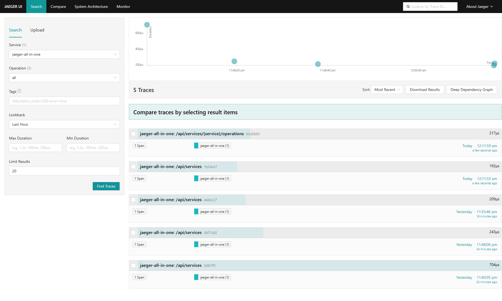

# Архитектурное решение по трейсингу

## 1. Системы, которые должны быть покрыты трейсингом

[C4-диаграммa в контексте планирования трейсинга](jewerly_c4_model_tracing.drawio)

### Данные для трейсинга (спаны и атрибуты)

Каждый сервис должен создавать спаны со следующими атрибутами:

#### Обязательные атрибуты для каждого спана

| Атрибут          | Значение                           |
|------------------|------------------------------------|
| `trace_id`       | Глобальный идентификатор заказа    |
| `span_id`        | Уникальный ID текущей операции     |
| `parent_span_id` | ID родительского спана (если есть) |
| `service.name`   | Имя сервиса                        |
| `operation.name` | Название операции                  |
| `timestamp`      | Время начала (Unix ns)             |
| `duration`       | Длительность в наносекундах        |
| `status`         | Успех/ошибка                       |

#### Бизнес-атрибуты (аннотации)

| Атрибут                      | Зачем                                                  |
|------------------------------|--------------------------------------------------------|
| `order.id`                   | Идентификатор заказа                                   |
| `user.id` (или `partner.id`) | Кто создал заказ                                       |
| `order.status`               | Текущий статус (INITIATED, PRICE_CALCULATED и т.д.)    |
| `3d_model.polygons_count`    | Количество полигонов (для диагностики долгих расчётов) |
| `queue.message_id`           | ID сообщения в RabbitMQ                                |
| `error.message`              | Текст ошибки (если есть)                               |

## 2. Мотивация

### Почему системе нужен распределённый трейсинг?

Компания «Александрит» столкнулась с классической проблемой распределённых систем: заказы «зависают» или теряются на
неизвестном этапе, а клиенты и партнёры жалуются на многомесячные задержки. Существующие метрики (RPS, загрузка CPU) и
логи не дают целостной картины прохождения заказа через несколько сервисов.

**Что даст трейсинг:**

1. **Восстановление пути заказа** - мы увидим, какие сервисы обрабатывали заказ, сколько времени это заняло и на каком
   шаге произошла ошибка.
2. **Обнаружение потерянных сообщений** - трейсинг покажет, было ли сообщение отправлено в RabbitMQ и было ли оно
   получено потребителем.
3. **Быстрая диагностика** - вместо часов ручного анализа логов, разработчик за 5 минут найдёт проблему через UI
   трейсинга.
4. **Прозрачность для бизнеса** - возможность строить отчёты: «95% заказов проходят от SUBMITTED до PRICE_CALCULATED за
   3 минуты».

### Технические и бизнес-метрики, на которые повлияет трейсинг

| Метрика                                                                   | Тип         | Целевое значение            |
|---------------------------------------------------------------------------|-------------|-----------------------------|
| **Mean Time To Detection (MTTD)** проблем с заказами                      | Техническая | Снижение с часов до 5 минут |
| **Mean Time To Resolution (MTTR)**                                        | Техническая | Снижение с дней до часов    |
| **Доля заказов с полным трейсом**                                         | Техническая | > 99.9%                     |
| **Среднее время подтверждения заказа** (от SUBMITTED до PRICE_CALCULATED) | Бизнесовая  | < 3 минут (сейчас 2–30+)    |
| **Количество «потерянных» заказов в месяц**                               | Бизнесовая  | 0 (сейчас есть жалобы)      |

## 3. Предлагаемое решение

### Технологический стек

| Компонент                | Технология                                               | Обоснование                                                               |
|--------------------------|----------------------------------------------------------|---------------------------------------------------------------------------|
| **Instrumentation**      | OpenTelemetry (OTel)                                     | Стандарт индустрии, поддержка Java, C#, JavaScript, не привязан к вендору |
| **Collector**            | Jaeger Collector или OpenTelemetry Collector             | Jaeger - зрелое решение с UI, OTel Collector - более гибкий               |
| **Storage**              | Elasticsearch (для больших объёмов) или Cassandra        | Elasticsearch удобен для поиска по атрибутам (order.id)                   |
| **Query & UI**           | Jaeger Query + UI                                        | Позволяет искать по trace_id, service, operation, duration                |
| **RabbitMQ integration** | RabbitMQ OpenTelemetry Plugin или manual instrumentation | Чтобы видеть сообщения в очередях                                         |

[Архитектура трейсинга (обновлённая C4)](jewerly_c4_model_tracing_containers.drawio)

### Дополнительное задание

Для автоматического контроля прохождения заказов и оперативного реагирования на сбои на базе данных распределённого
трейсинга внедряется дополнительный контур обработки: **Trace Analyzer**, **Business Alert Manager**, **SLO Dashboard**,
**SLO Dashboard DB**.

#### Реализация

| Компонент                  | Назначение                                                                                                    |
|----------------------------|---------------------------------------------------------------------------------------------------------------|
| **Trace Analyzer**         | Потоковая обработка спанов, выявление аномалий (потеря сообщений, превышение таймаутов, незавершённые трейсы) |
| **Business Alert Manager** | Приём событий от анализатора, маршрутизация алертов в Slack, Jira                                             |
| **SLO Dashboard DB**       | Хранение агрегированных метрик (время прохождения по этапам, доля успешных заказов)                           |
| **Business SLO Dashboard** | Визуализация SLO для продакт-менеджера и команды поддержки                                                    |

1. **Trace Collector** передаёт поток спанов в **Trace Analyzer** (через Kafka или gRPC-стриминг).
2. **Trace Analyzer** в реальном времени:
    - Сопоставляет спаны одного трейса (по `trace_id`).
    - Вычисляет длительности между ключевыми
      статусами (`SUBMITTED` - `PRICE_CALCULATED` - `MANUFACTURING_STARTED` - `CLOSED`).
    - Детектирует аномалии: отсутствие ожидаемого спана, длительность выше порога, ошибки.
3. При обнаружении аномалии **Trace Analyzer** отправляет событие в **Business Alert Manager**.
4. **Business Alert Manager**:
    - Отправляет сообщение в Slack.
    - Создаёт тикет в Jira с приоритетом High/Critical.
5. **Trace Analyzer** регулярно пишет агрегированные метрики в **SLO Dashboard DB**.
6. **SLO Dashboard** (Grafana) отображает метрики для бизнеса и поддержки.

[Контроль прохождения заказов и оперативного реагирования на сбои (обновлённая C4)](jewerly_c4_model_tracing_analyze.drawio)

## 3. Компромиссы

| Ситуация                                                                                   | Почему не поможет                                                                                                | Что делать вместо                                                                                                                      |
|--------------------------------------------------------------------------------------------|------------------------------------------------------------------------------------------------------------------|----------------------------------------------------------------------------------------------------------------------------------------|
| **Проблема в проприетарной системе** (например, стороннее API доставки или платёжный шлюз) | Не можем внедрить OpenTelemetry в чужой закрытый код                                                             | Мониторинг логов и метрик на границе системы (таймауты, коды ответов), а также ручной аудит по логам этой системы                      |
| **Ошибка в самом RabbitMQ** (падение брокера, потеря сети)                                 | Сообщение физически не будет отправлено - спан не появится                                                       | Мониторинг самого RabbitMQ (метрики: alive, queue length, consumer count) через Prometheus экспортёр; алерты при недоступности брокера |
| **Пользовательская ошибка** (загружен невалидный 3D-файл)                                  | Трейс покажет факт ошибки, но не исправит данные и не подскажет, какую именно проблему нужно решить пользователю | Добавить валидацию на стороне фронтенда (Three.js) с детальными подсказками; трейс должен нести только факт ошибки, а не её причины    |
| **Проблема в инфраструктуре** (сгорел диск, отказал сетевой коммутатор)                    | Трейсинг сам станет недоступен, и мы не узнаем о проблеме через него                                             | Использовать внешний мониторинг (например, Yandex Cloud Monitoring) для базовых проверок доступности инстансов и сети                  |

## 4. Аспекты безопасности

### Угрозы и меры защиты

| Угроза                                           | Мера защиты                                                                              |
|--------------------------------------------------|------------------------------------------------------------------------------------------|
| Несанкционированный доступ к трейсам             | Аутентификация через SSO с 2FA, авторизация по ролям, доступ только из корпоративной VPN |
| Утечка персональных данных через атрибуты спанов | Код-ревью, фильтрация атрибутов на уровне Collector, регулярный скрининг хранилища       |
| Перегрузка системы трейсинга (DoS)               | Rate limiting на уровне Collector, семплирование, мониторинг и алертинг                  |
| Подделка трейсов (injection)                     | mTLS между сервисами и Collector, приём трафика только из внутренней сети                |
| Компрометация хранилища трейсов                  | Шифрование дисков, автоматическое удаление старых трейсов, отсутствие публичного IP      |
| Перехват трафика между сервисами и Collector     | TLS на всех коммуникациях, mTLS с взаимной аутентификацией                               |

### Аутентификация и авторизация

**Доступ к UI трейсинга:**

- SSO (Keycloak / Yandex Passport) с обязательной двухфакторной аутентификацией
- Роли: `tracing_viewer` (разработчики, поддержка), `tracing_admin` (DevOps), `tracing_auditor` (комплаенс)
- Доступ только через корпоративную VPN или с доверенных IP

**Отправка трейсов от сервисов:**

- mTLS с проверкой сертификатов клиентов
- Список разрешённых Common Name (CN) для каждого сервиса
- Collector не доступен из публичного интернета

### Маскирование чувствительных данных

**Запрещённые атрибуты (удаляются или хешируются):**

- `user.email`, `user.phone`, `user.address`
- `delivery.address`, `payment.card_number`
- `passport.*`, `auth.token`, `password`

**Разрешённые атрибуты:**

- `order.id`, `trace_id`, `user.id` (только хеш)
- `service.name`, `operation.name`, `duration`, `status`
- `order.price`, `order.status`, технические характеристики

**Механизмы контроля:**

- Фильтрация атрибутов в OpenTelemetry Collector
- Утилита `SafeSpan` в коде с проверкой имён атрибутов
- Статический анализ (Checkstyle/PMD) в CI/CD

### Аудит доступа

**Логируются все действия пользователей с UI:**

- Кто, когда, с какого IP выполнял поиск
- Какой запрос и какие trace_id были возвращены

**Хранение и retention:**

- Отдельный индекс в Elasticsearch с retention 1 год
- Доступ к логам только у `tracing_admin` и `tracing_auditor`

**Алертинг по логам аудита:**

- Аномально высокая частота запросов - временная блокировка
- Поиск по чувствительным ключевым словам (`email`, `phone`) - критический алерт и отзыв прав
- Доступ из недоверенной страны - блокировка

# Задание 3.1. Трейсинг с OpenTelemetry и Jaeger

